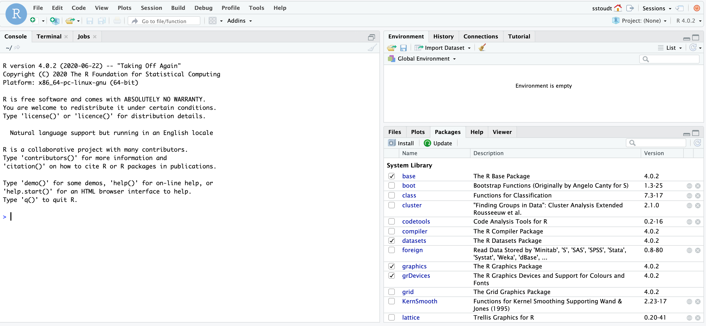
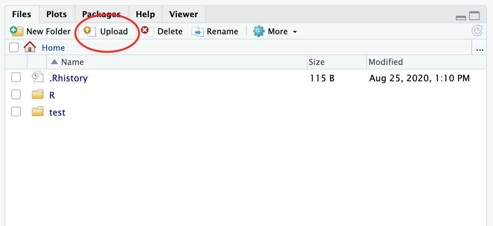
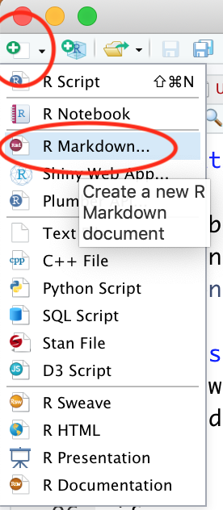
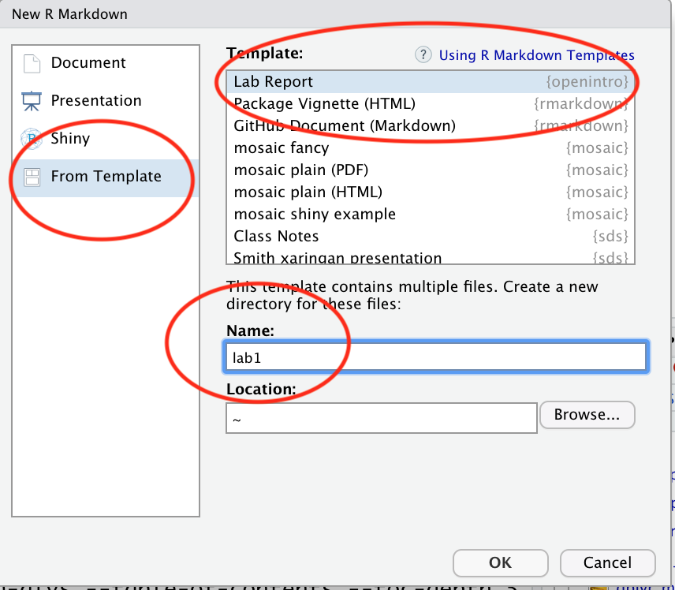
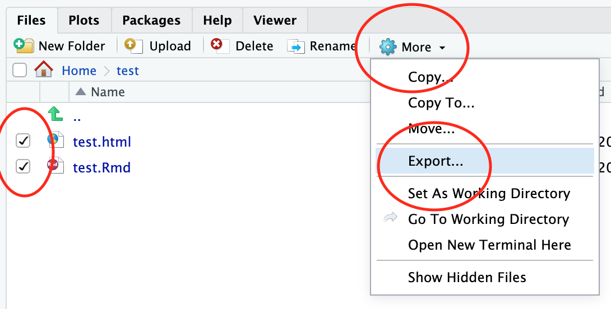
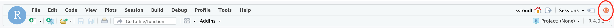

```{r global_options, include=FALSE}
knitr::opts_chunk$set(eval = TRUE, results = FALSE)
library(tidyverse)
library(openintro)
```

## Logistics

This lab will occur remotely and in teams of three. For those of you participating synchronously, you will find the Zoom room information on [Moodle](https://moodle.smith.edu/). I will assign you to random breakout rooms. I will be available in the main Zoom room to answer questions. If you have a question or technical problem, click the "Ask for Help" button (it looks like a question mark) in the meeting controls, and I will be alerted to join your breakout room.  

For those of you participating asynchronously, alert me to technical challengs over Slack DM, and I will get back to you as soon as possible. For questions about the content of the lab, please sign up for an office hour time block. 

Each of you should be writing and running code, examining output, and answering the exercises throughout the lab. However, you only need to turn in one final lab report. To be clear, everyone submits files to Moodle, but the files can be the same within a group. Today one of you should be the main recorder of answers in the lab document. You will share this document with your teammates. As you work it may be helpful to share your screen. You will be working with this same group for the next lab, so you will switch roles next week. 

You all should also feel free to ask and answer questions amongst yourselves via Zoom if participating synchronously or via Slack if participating asynchronously. Please note at the end of the lab document who you consulted for help.

## The RStudio Interface

The goal of this lab is to introduce you to R and RStudio, which you'll be using throughout the course both to learn the statistical concepts discussed in the course and to analyze real data and come to informed conclusions. 
To clarify which is which: R is the name of the programming language itself and RStudio is a convenient interface.

As the labs progress, you are encouraged to explore beyond what the labs dictate; a willingness to experiment will make you a much better programmer. 
Before we get to that stage, however, you need to build some basic fluency in R. 
Today we begin with the fundamental building blocks of R and RStudio: the interface, reading in data, and basic commands.

Go ahead and launch Smith's RStudio Server [here](https://rstudio.smith.edu/). Your username and password are the same as your Smith e-mail. You do *not* need to have any particular software installed on your computer to access the server.

You should see a window that looks like the image shown below.

```{r r-server-interface-2020, echo=FALSE, results="asis"}
 
```

If you cannot access the server, call me into your breakout room.

The panel on the lower left is where the action happens. It's called the *console*. 
Everytime you launch RStudio, it will have the same text at the top of the console telling you the version of R that you're running. 
Below that informationis the *prompt*. 
As its name suggests, this prompt is really a request: a request for a command. 
Initially, interacting with R is all about typing commands and interpreting the output. 
These commands and their syntax have evolved over decades (literally) and now provide what many users feel is a fairly natural way to access data and organize, describe, and invoke statistical computations.

The panel in the upper right contains your *environment* as well as a history of the commands that you've previously entered. 

Any plots that you generate will show up in the panel in the lower right corner. 
This is also where you can browse your files, access help, manage packages, etc.

### Uploading Files to the Server

To import files to the R Server click the "Upload" button in the bottom right panel. From there navigate to where the file is saved on your personal computer. 

1. Import the "intro_to_r.Rmd" file to the server.

```{r upload, echo=FALSE, results="asis"}
 
```

### R Packages

R is an open-source programming language, meaning that users can contribute packages that make our lives easier, and we can use them for free. 
For this lab, and many others in the future, we will use the following R packages:

- The suite of **tidyverse** packages: for data wrangling and data visualization
- **openintro**: for data and custom functions with the OpenIntro resources

These packages are already installed on the R Server, but you need to load these packages in your working environment. We do this with the `library` function. Run the following three lines in your console (bottom left panel).

```{r load-packages, message=FALSE}
library(tidyverse)
library(openintro)
```

You only need to *install* packages once, but you need to *load* them using `library` each time you relaunch RStudio. 

The Tidyverse packages share common philosophies and are designed to work together. 
You can find more about the packages in the tidyverse at [tidyverse.org](http://tidyverse.org/).


### Creating a reproducible lab report

We will be using R Markdown to create reproducible lab reports. See the following videos describing why and how. Note they will refer to the `oilabs` package. This has been renamed the `openintro` package.

[**Why use R Markdown for Lab Reports?**](https://youtu.be/lNWVQ2oxNho)
<iframe width="560" height="315" src="https://www.youtube.com/embed/lNWVQ2oxNho" frameborder="0" allowfullscreen></iframe>

[**Using R Markdown for Lab Reports in RStudio**](https://youtu.be/o0h-eVABe9M)
<iframe width="560" height="315" src="https://www.youtube.com/embed/o0h-eVABe9M" frameborder="0" allowfullscreen></iframe>

1. In RStudio, go to New File -> R Markdown... Then, choose From Template and then choose `Lab Report {openintro}` from the list of templates.

```{r fileNew, echo=FALSE, results="asis"}
 
```

```{r template, echo=FALSE, results="asis"}
 
```

Going forward you should refrain from typing your code directly in the console, and instead type any code (final correct answer, or anything you're just trying out) in the R Markdown file and run the chunk using either the Run button on the chunk  (green sideways triangle) or by highlighting the code and clicking Run on the top  right corner of the R Markdown editor. 
If at any point you need to start over, you  can Run All Chunks above the chunk you're working in by clicking on the down arrow in the code chunk.

## Dr. Arbuthnot's Baptism Records

To get started, let's take a peek at the data.

```{r load-abrbuthnot-data}
arbuthnot
```

You can run the command by

- clicking on the green arrow at the top right of the code chunk in the R Markdown (Rmd) file, or
- putting your cursor on this line, and clicking the **Run** button on the upper right corner of the pane, or
- holding `Ctrl-Shift-Enter`, or
- typing the code in the console.

This command instructs R to load some data: the Arbuthnot baptism counts for boys and girls. 
You should see that the environment area in the upper righthand corner of the RStudio window now lists a data set called `arbuthnot` that has 82 observations on 3 variables. 
As you interact with R, you will create a series of objects. 
Sometimes you load them as we have done here, and sometimes you create them yourself as the byproduct of a computation or some analysis you have performed.

The Arbuthnot data set refers to the work of Dr. John Arbuthnot, an 18<sup>th</sup> century physician, writer, and mathematician. 
He was interested in the ratio of newborn boys to newborn girls, so he gathered the baptism records for children born in London for every year from 1629 to 1710. Once again, we can view the data by typing its name into the console.

Note: In this historical dataset, babies are classified by sex into "boys" and "girls," but I acknowledge that both sex and gender do not exist in a binary form.

```{r view-data}
arbuthnot
```

However, printing the whole dataset in the console is not that useful. 
One advantage of RStudio is that it comes with a built-in data viewer. 
Click on the name `arbuthnot` in the *Environment* pane (upper right window) that lists the objects in your environment. 
This will bring up an alternative display of the data set in the *Data Viewer* (upper left window). 
You can close the data viewer by clicking on the `x` in the upper lefthand corner.

What you should see are four columns of numbers, each row representing a different year: the first entry in each row is simply the row number (an index we can use to access the data from individual years if we want), the second is the year, and the third and fourth are the numbers of boys and girls baptized that year, respectively. 
Use the scrollbar on the right side of the console window to examine the complete data set.

Note that the row numbers in the first column are not part of Arbuthnot's data. 
R adds them as part of its printout to help you make visual comparisons. 
You can think of them as the index that you see on the left side of a spreadsheet. 
In fact, the comparison to a spreadsheet will generally be helpful. 
R has stored Arbuthnot's data in a kind of spreadsheet or table called a *data frame*.

You can see the dimensions of this data frame as well as the names of the variables and the first few observations by typing:

```{r glimpse-data}
glimpse(arbuthnot)
```

It is better practice to type this command into your console, since it is not necessary code to include in your solution file.

This command should output the following

```{r glimpse-data-result, echo=FALSE, results="asis"}
glimpse(arbuthnot)
```

We can see that there are 82 observations and 3 variables in this dataset. The variable names are `year`, `boys`, and `girls`. 
At this point, you might notice that many of the commands in R look a  lot like functions from math class; that is, invoking R commands means supplying a function with some number of arguments.
The `glimpse` command, for example, took a single argument, the name of a data frame. 

1. Put `glimpse(arbuthnot)` where you see "# Insert code for Exercise 1 here" in you lab report.

1. When you are finished editing your Markdown document click the "Knit" button and choose "Knit to HTML" in the top left corner of RStudio. This will run all of your code and create a formatted document of the output. If you get an error, it means something in your Markdown file isn't right, either an error in code or some error in formatting. Call me into your breakout room, and we will troubleshoot.

## Exporting Files From the Server

To export files from the R server to your personal computer so that you can turn in the files on Moodle, put a check mark by the file names that you want to download (in the bottom right panel). Click the "More" button and then choose "Export". This will cause a zip file to be dowloaded to your computer. You can unzip this folder (double click on it) to retrieve your documents. 

1. Export both your lab1.Rmd and lab1.html files.

```{r export, echo=FALSE, results="asis"}
 
```

When you are finished on the server, always exit your session before closing the browser. If it asks to save your workspace say "no". 

1. Exit your server session by clicking on the orange button at the top right.

```{r exit, echo=FALSE, results="asis"}
 
```

## Dowloading R and RStudio on your own computer

The RStudio Server requries an internet connection and is constrained by how many Smithies are using it at any given time. It can be helpful to have a version of R and RStudio that are local to your device.

1. Download R [here](https://cran.r-project.org/mirrors.html). Choose the CRAN mirror site that is closest to you. In the box labeled "Download and Install R," click the link corresponding to your operating system.

1. Download RStudio by clicking on the "Download" button under the free version of RStudio Desktop [here](https://rstudio.com/products/rstudio/download/). Check that the recommended version matches your operating system and click the "Download RStudio for..." button.

1. Check that it worked by launching RStudio. You should see a window that looks like the image shown below.

```{r r-interface-2020, echo=FALSE, results="asis"}
knitr::include_graphics("img/r-interface-2020.png")
```

Call me into your breakout room if you are having trouble with this process. 

Note: These download instructions are adapted from [this blog post](https://towardsdatascience.com/how-to-install-r-and-rstudio-584eeefb1a41).

## Installing Packages

We need to install packages so they are available in your R environment. 

1. Install the `tidyverse` and `openintro` packages by typing the following two lines of code into the console of your RStudio session, pressing the enter/return key after each one. You may need to select a server from which to download; any of them will work.

```{r install-packages, message=FALSE, eval=FALSE}
install.packages("tidyverse")
install.packages("openintro")
```

Note that you can check to see which packages (and which versions) are installed by inspecting the *Packages* tab in the lower right panel of RStudio. 

## Resources for learning R and working in RStudio

That was a short introduction to R and RStudio, but we will provide you with more functions and a more complete sense of the language as the course progresses. 

In this course we will be using the suite of R packages from the **tidyverse**. 
The book [R For Data Science](https://r4ds.had.co.nz/) by Grolemund and Wickham is a fantastic resource for data analysis in R with the tidyverse. 
If you are googling for R code, make sure to also include these package names in your search query. For example, instead of googling "scatterplot in R", google "scatterplot in R with the tidyverse".

These cheatsheets may come in handy throughout the semester:

- [RMarkdown cheatsheet](https://github.com/rstudio/cheatsheets/raw/master/rmarkdown-2.0.pdf)
- [Data transformation cheatsheet](https://github.com/rstudio/cheatsheets/raw/master/data-transformation.pdf)
- [Data visualization cheatsheet](https://github.com/rstudio/cheatsheets/raw/master/data-visualization-2.1.pdf)

Note that some of the code on these cheatsheets may be too advanced for this course.
However the majority of it will become useful throughout the semester.

## Deliverables

Submit your Markdown document and knitted file to [Moodle](https://moodle.smith.edu/) as:

LastName-LastName-LastName-L-01.Rmd  

LastName-LastName-LastName-L-01.html

Confirm that you are able to get through all 10 exercises (as a note on your Moodle submission).

*Due*: Monday,  (beginning of class time Eastern time)

* * *

<a rel="license" href="http://creativecommons.org/licenses/by-sa/4.0/"></a><br />This work is licensed under a <a rel="license" href="http://creativecommons.org/licenses/by-sa/4.0/">Creative Commons Attribution-ShareAlike 4.0 International License</a> and was adapted by Sara Stoudt.
